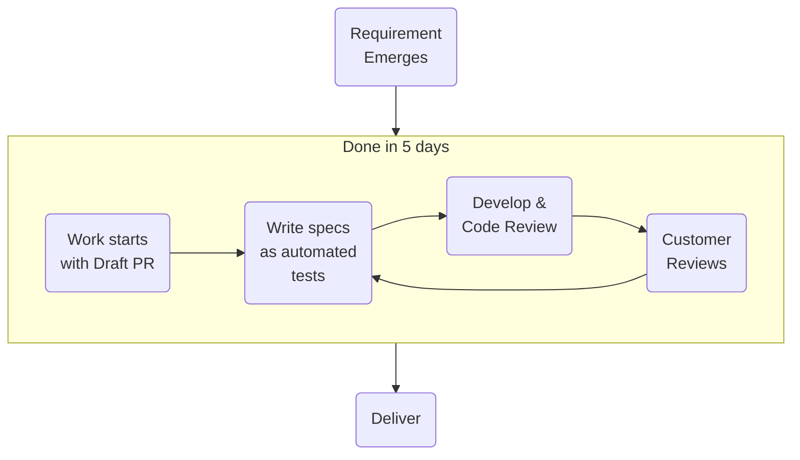

::block

:::banner

## Experiment and learn, while
# Delivering at pace

We are a __self-managing__ team with a single point of contact assigned per
client, operating on a __time & materials__ basis without requiring a
fixed-budget or a fixed-plan thanks to our fast response time.

:::

::

::block{color=black}

::

:block{content="contents/become-partner.md"}
:block{content="contents/lets-meet.md" color=black}

::block

:::banner

::::columns{:itemWidths='["80%", "20%"]' imageBehavior='icon'}

#text

### Low Cost of Change

Our approach minimizes change costs through automated testing and continuous
refactoring, ensuring adaptability without additional expenses.

:::::bullet-list

- Test automation
- Refactoring
- Tech-stack update

:::::

#image

::::

:::

:br

### See in action

:::columns

#baked-builds

#### Tests and Coverage

Check out one of our open source project, Baked, to see how we utilize test
automation;

:link-button{to="https://github.com/mouseless/baked/actions/runs/18309280610" text="See in GitHub"}

#net-upgrade

#### Research Upgrades

We provide our customers with technology upgrades out of the box. Check out how
we manage tech upgrades.

:link-button{to="https://github.com/mouseless/learn-nuxt/pull/68" text="See in GitHub"}

#baked-net-upgrade

#### Apply Upgrades

Using our opinionated framework we manage to easily upgrade customer projects.

:link-button{to="https://baked.mouseless.codes/release-notes/v0-13#net-upgrade" text="See in Baked"}

:::

::

::block{color=black}

:::banner

::::columns{:itemWidths='["80%", "20%"]' imageBehavior='icon'}

#text

### Continuous Delivery

We guarantee rapid delivery with a 3-day lead time and an end-to-end CI/CD
setup, prioritizing efficiency and reliability.

:::::bullet-list

- 5 days of average lead-time
- No estimation, continuous planning
- End to end CI/CD setup

:::::

#image

::::

:::

:br

### See in action

:::columns

#freq-releases

#### Frequent Releases

Check out Baked releases to see frequency of our delivery cycle;

:link-button{to="https://github.com/mouseless/baked/releases" text="See in GitHub"}

#lead-time

#### Lead-Time

See how we build software incrementally;

:link-button{to="https://github.com/mouseless/baked/pulls?q=label%3APublish+is%3Aclosed" text="See in GitHub"}

:::

::

::block

:::banner

::::columns{:itemWidths='["80%", "20%"]' imageBehavior='icon'}

#text

### Progress Visibility

Through draft PRs from project inception, detailed task management, and clear
communication, we maintain transparency at every development stage.

:::::bullet-list

- Draft PRs right from beginning
- Well detailed task lists
- Clear commit messages

:::::

#image

::::

:::

:br

### See in action

:::columns

#baked-epic

#### PRs

Check out our live work right from GitHub;

:link-button{to="https://github.com/mouseless/baked/pulls" text="See in GitHub"}

#learn-task

#### Tasks

See how we care work descriptions and tasks;

:link-button{to="https://github.com/mouseless/baked/pull/312" text="See in GitHub"}

:::

::

::block{color=black}

:::banner

::::columns{:itemWidths='["80%", "20%"]' imageBehavior='icon'}

#text

### Cross Pollination

Our commitment to open source and diverse project engagement promotes knowledge
exchange, enhancing innovation across the community.

:::::bullet-list

- Open Source
- Continuous Learning

:::::

#image

::::

:::

:br

### See in action

:::columns

#baked-docs

#### Baked

Check out Baked, our opinionated framework for .NET and Vue;

:link-button{to="https://baked.mouseless.codes" text="See Baked"}

#learn-nuxt

#### Learn

See how we learned, documented and use Nuxt;

:link-button{to="https://mouseless.github.io/learn-nuxt" text="Learn Nuxt"}

#all-open-source

#### Open Source

See what we've open sourced so far;

:link-button{to="https://github.com/mouseless?type=public" text="See in GitHub"}

:::

::

:block{content="contents/lets-meet.md"}
:block{content="contents/tedious-work.md" color=black}
:block{content="contents/explore-long-term.md"}
:block{content="contents/our-collective.md" color=black}
:block{content="contents/lets-meet.md"}

::block{color=black}

## Questions you might have

:include{content="contents/questions/project-management.md"}
:include{content="contents/questions/common.md"}

::
