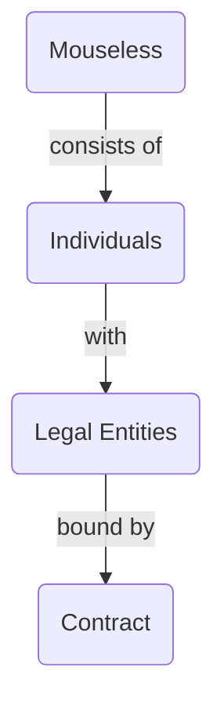
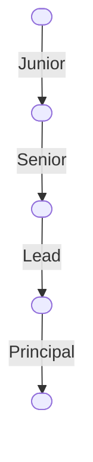

::block

:::banner

### A software development collective;
# Connected through the craft

Our collective is a team of software engineers guided by our people-centric
philosophy, focusing on delivering quality work collaboratively.

:::

::

::block{color=black}

:::columns{:itemWidths='["100%", "25ch"]'}

#text

::::banner

### Our structure

At Mouseless, we function as a cohesive team of engineers. Our structure is
designed to promote collaboration and communication, aligning with our
people-centric philosophy.

::::

Within our collective, one of our engineers serves as the single point of
contact, managing all client communications and operations seamlessly. This
ensures clear and efficient communication, allowing us to focus on delivering
continuous software increments.

We use our [Matrix][] server for daily communication. For detailed governance
information, please see [github.com/mouseless/governance][].

Development is split into small increments, each with an owner and a reviewer,
targeted for completion within a week. At the end of each month, we analyze our
worklogs and discuss how to organize for upcoming tasks. This helps us maintain
a balance between different types of work and skills, ensuring continuous
improvement and high-quality outcomes.

#chart

:::

::

::block

:::banner

### People-centric

We prioritize our people above all else, promoting open communication and
efficiency. With this philosophy, our collective keeps its focus on its craft
which eventually leads to excellence.

:::

:br

:::columns

#passionate

::::card{image="images/our-collective/passionate.png"}

### Passionate

As software engineers, we constantly debate over better and cleaner ways to
write code, even after its delivery. It's not just about the end product; it's
the inherently elegant and fascinating nature of the work itself that keeps us
engaged.

::::

#efficient

::::card{image="images/our-collective/efficient.png"}

### Efficient

We prioritize quality over speed, understanding that rushing can result in
costly errors. To achieve a balance between quality and productivity, we employ
effective scope management and incremental delivery.

::::

#unconventional

::::card{image="images/our-collective/unconventional.png"}

### Unconventional

It is our path to evolution. It involves trying and experimenting, embracing new
approaches even when they make us feel strange and uneasy. We are perfectly fine
with stepping out of the comfort zone, inviting the unconventional.

::::

#excellent

::::card{image="images/our-collective/excellent.png"}

### Excellent

We view perfection as doing the best we can each day, understanding that it's a
dynamic goal, not an unchanging ideal. With this perspective, we pursue
excellence in our work every day.

::::

:::

::

::block{color=black}

:::columns{:itemWidths='["100%", "19ch"]'}

#content

::::banner

### Our people

We are exclusive in expertise, inclusive in participation.

::::

::::columns{:itemWidths='["34%", "66%"]'}

#team

#### Team

We are independent engineers who are committed to work in accordance with [the
mouseless way](./how-we-work.md) where everyone has a contribution rate that
aligns with their level of experience in the field.

:people

#join

#### Join us

If you are an experienced software engineer and you think you align with our
principles and appreciate what you've seen in [github.com/mouseless][github],
let us know.

If you are a recent graduate seeking opportunities, consider our __Fresh
Engineer__ program. You join us as a new graduate. We'll guide you through our
way, assign you with real customer tasks, and regraduate you after two years of
dedicated work.

::::

#diagram

:::

::

:block{content="contents/lets-meet.md"}
:block{content="contents/balancing-quality.md" color=black}
:block{content="contents/tedious-work.md"}
:block{content="contents/explore-long-term.md" color=black}
:block{content="contents/lets-meet.md"}

::block{color=black}

## Questions you might have

:include{content="contents/questions/structure.md"}
:include{content="contents/questions/common.md"}

::

[github]: https://github.com/mouseless
[github.com/mouseless/governance]: https://github.com/mouseless/governance
[matrix]: https://matrix.to/#/#collective:mouseless.org
