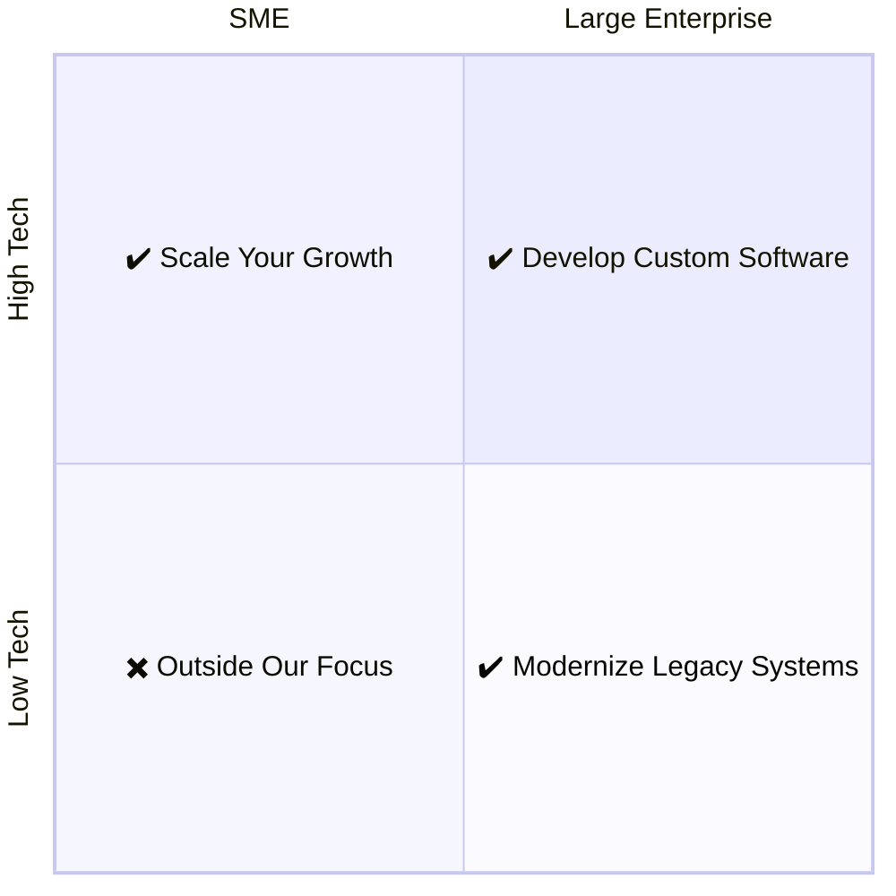

::block

:::banner

### We offer;
# Software Development
# as a Service

We build long-term partnerships to take __full responsibility__ of in-house
software and modernize legacy systems.

:::

::

::block{color=black}

:::columns{:itemWidths='["100%", "100ch"]'}

#text

::::banner

### Let's match your business needs

We're here to develop software solutions, whether you're a small startup or a
big player in the market.

::::

For large enterprises in high-tech environments, we specialize in developing
custom software solutions to keep them at the forefront of technology.
Similarly, for those in low-tech environments, we offer modernizing legacy
systems to enhance efficiency and competitiveness.

For small and medium-sized enterprises (SMEs) navigating high-tech landscapes,
we offer expertise in scaling their growth through strategic IT solutions. While
we recognize the importance of SMEs in low-tech environments, our focus lies
elsewhere at present.

#chart

:::

::

::block

:::banner

## Custom Software Development

We provide an agile, self-managing software development team to align with your
business demands.

:::

:::columns{:itemWidths='["85%", "15%"]'}

#text

If you struggle to keep your team's capacity aligned with your business demands,
we offer an established self-managing software development team. As a team that
embraces agile software development practices, we eagerly tackle any engineering
challenge.

At Mouseless, we've designed our collective to be centered around the software
engineering profession. This environment naturally encourages us to research,
experiment, and share our learnings with our customers.

#image

:::

:br
:br

:::banner

## Software Re-engineering

We offer our expertise to update and maintain your legacy in-house software.

:::

:::columns{:itemWidths='["15%", "85%"]'}

#image

#text

If you develop an in-house software, it's likely to become outdated and miss out
essential technology upgrades. Organizations naturally prioritize their business
challenges over technical needs which creates a persistent problem that requires
professional attention.

We're more than willing to offer our expertise to take full responsibility for
such systems. It enables your workforce to focus on business concerns while
granting us an opportunity to address engineering challenges.

:::

::

:block{content="contents/become-partner.md" color=black}
:block{content="contents/lets-meet.md"}
:block{content="contents/explore-long-term.md" color=black}
:block{content="contents/balancing-quality.md"}
:block{content="contents/our-collective.md" color=black}
:block{content="contents/lets-meet.md"}

::block{color=black}

## Questions you might have

:include{content="contents/questions/services.md"}
:include{content="contents/questions/common.md"}

::
